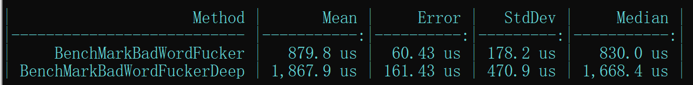

# 如何方便、快速的过滤非法关键词？

<!-- keywords:敏感词过滤;工具;LimFx; -->
<!-- description:很多时候，在用户输入的信息组成的一个请求object中，有很多个字段需要进行敏感词过滤。对每个字段单独调用过滤函数会导致代码复杂。是否有能对任何object一次性进行全字段过滤的方法？ -->

## 目录
- [如何方便、快速的过滤非法关键词？](#如何方便快速的过滤非法关键词)
  - [目录](#目录)
  - [为何进行敏感词过滤](#为何进行敏感词过滤)
  - [敏感词过滤难点](#敏感词过滤难点)
  - [过滤算法](#过滤算法)
  - [使用方法](#使用方法)
  - [性能](#性能)

## 为何进行敏感词过滤
敏感词过滤能够防止一些不怀好心的用户破坏网络环境，防止卖片哥用自己的名字之类的打广告。  
## 敏感词过滤难点  
1. **过滤速度慢**  
    单纯的过滤一些关键字是非常简单的。绝大部分的语言都内置了replace功能，单纯的用replace都可以堆出敏感词过滤。但是这么做的过滤效率通常很低。正则表达式一般的速度也很慢，所以直接这样过滤数量庞大的敏感词不合适。  
2. **过滤代码复杂**  
   现代应用中，用户的输入往往不是一个单独的字段，而是有很多文本字段的object对象，而编程者要对每个object的每个`string`类型字段、甚至`string[]`等单独调用一次过滤函数，这会导致代码变得很复杂，而且可读性不佳，看起来也很丑，写起来也烦（花很多时间写没水平的重复代码）  

现代有些应用采用前端过滤的方法，原因是前端过滤不占用服务器资源。但是这导致前端代码复杂化，而且前端过滤速度一般较慢。  
为了完美解决上方的两个问题，LimFx封装了专门的`BadWordService`，帮助开发者快速地对任何object的所有字段进行快速过滤。  
## 过滤算法
`BadWordService`的过滤算法使用[ToolGood.Word开源库](https://github.com/toolgood/ToolGood.Words)，其搜索速度比标准c#正则匹配速度快8.8万倍，完美解决过滤慢的问题。
## 使用方法
首先，`BadWordService`是LimFx.Common的一部分，目前不能单独获取。请通过引用[LimFx.Common](https://www.nuget.org/packages/LimFx.Common/)获取它的功能。  
`BadWordService`对ToolGood.Word的过滤方法进行封装，目前提供两个过滤函数`BadWordFucker`和`BadWordFuckDeep`。  
我们通过例子来说明它们的用法：  
```cs
using LimFx.Business.Services;
using Microsoft.VisualStudio.TestTools.UnitTesting;
using System.Collections.Generic;

namespace LimFx.Common.Test
{
    class Bad
    {
        public string bad1 { get; set; }
        [BadWordIgnore]
        public string bad2 { get; set; }
        public string bad3 { get; set; }
        public string[] bad4 { get; set; }
        public List<string> bad5 { get; set; }
        public Bad innerBad { get; set; }
        [BadWordIgnore]
        public Bad innerGood { get; set; }
    }
    [TestClass]
    public class BadWordFuckerTest
    {
        BadWordService badWordService;
        [TestInitialize]
        public void Init()
        {
            badWordService = new BadWordService();
        }

        [TestMethod]
        public void TestBadWordFucker()
        {
            var temp = badWordService.BadwordsFucker(GetNewBad());
            Assert.AreEqual("****", temp.bad1);
            Assert.AreNotEqual("****", temp.bad2);
            Assert.AreEqual("****", temp.bad3);
            Assert.AreEqual("****", temp.bad4[0]);
            Assert.AreEqual("****", temp.bad5[0]);
        }
        [TestMethod]
        public void TestBadWordFuckerDeep()
        {
            var temp1 = badWordService.BadwordsFuckerDeep(new Bad 
            { 
                innerBad = GetNewBad(), 
                innerGood = GetNewBad() 
            });
            var temp = temp1.innerBad;
            Assert.AreEqual("****", temp.bad1);
            Assert.AreEqual("****", temp.bad3);
            Assert.AreEqual("****", temp.bad4[0]);
            Assert.AreEqual("****", temp.bad5[0]);
            temp = temp1.innerGood;
            Assert.AreNotEqual("****", temp.bad1);
            Assert.AreNotEqual("****", temp.bad3);
            Assert.AreNotEqual("****", temp.bad4[0]);
            Assert.AreNotEqual("****", temp.bad5[0]);
        }
        Bad GetNewBad()
        {
            return new Bad
            {
                bad1 = "fuck",
                bad2 = "fuCK",
                bad3 = "FUck",
                bad4 = new[] { "fuck", "fuCK" },
                bad5 = new List<string> { "fuck" }
            };
        }
    }
}

```
可以看到，`BadWordFucker`对`Bad`类中的**所有**`string`、`string[]`和`IList<string>`类型的字段进行了过滤，`BadWordFuckDeep`则递归地对其内部属性中的`string`、`string[]`和`IList<string>`类型字段也进行了过滤。也就是说使用这两个函数，开发人员将不再需要对不同的object写不同的敏感词过滤函数。只需要直接调用这两个函数即可！  
而`BadWordIgnoreAttribute`则会让过滤函数忽略带有它的字段。  
## 性能
我们也对性能做了一些BenchMark，在用`BadWordFuckDeep`过滤每层有5000个单词的字段两层嵌套的object的时候，平均用时不到2ms。  



